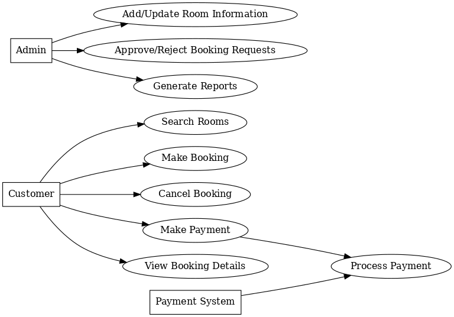

# Requirement Analysis in Software Development

## Introduction
This repository documents the **Requirement Analysis Project**, which focuses on building a strong foundation for software development through clear, structured, and well-documented requirements.  

The project simulates a real-world booking management system scenario and highlights the importance of requirement gathering, analysis, and documentation within the Software Development Lifecycle (SDLC).  

---

## What is Requirement Analysis?
Requirement Analysis is the process of **identifying, documenting, and managing the needs and expectations** of stakeholders for a software system.  
It serves as the foundation of the **Software Development Lifecycle (SDLC)** by ensuring that developers, designers, and stakeholders share a common understanding of what the system should do.  

### Importance in SDLC
- Prevents misunderstandings between stakeholders and developers.  
- Reduces costly rework by clarifying needs early.  
- Provides a roadmap for design, development, and testing.  
- Ensures alignment between business goals and the technical solution.  

---

## Why is Requirement Analysis Important?
1. **Clarity and Alignment**  
   Ensures that all stakeholders (users, developers, managers, clients) share the same vision and expectations.  

2. **Cost and Time Efficiency**  
   Detecting and fixing issues during requirement analysis is far cheaper than fixing them after development.  

3. **Foundation for Design and Testing**  
   Clear requirements serve as input for both **system design** and **test cases**, ensuring that the final product meets expectations.  

---

## Key Activities in Requirement Analysis
- **Requirement Gathering**  
  Collecting information from stakeholders about what the system must achieve.  

- **Requirement Elicitation**  
  Using interviews, surveys, brainstorming sessions, and workshops to uncover detailed needs.  

- **Requirement Documentation**  
  Writing down requirements clearly in formats like Software Requirement Specification (SRS).  

- **Requirement Analysis and Modeling**  
  Analyzing collected requirements, identifying conflicts, prioritizing, and modeling them using diagrams.  

- **Requirement Validation**  
  Ensuring requirements are complete, consistent, feasible, and testable before moving forward.  

---

## Types of Requirements

### Functional Requirements
Functional requirements define **what the system should do**.  
They describe specific features, behaviors, and functions of the system.  

**Examples for Booking Management System**:  
- Users can search for available properties by location and date.  
- Users can view property details (price, description, amenities, availability).  
- The system allows users to book a property and receive a confirmation.  
- Users can cancel or modify bookings within policy limits.  

### Non-functional Requirements
Non-functional requirements describe **how the system performs** its functions.  
They define constraints, quality attributes, and performance expectations.  

**Examples for Booking Management System**:  
- The system should load search results within **3 seconds**.  
- The system must support **at least 1,000 concurrent users**.  
- All sensitive user data (e.g., payment info) must be **encrypted**.  
- The system should be available **99.9% of the time**.  

---

## Use Case Diagrams
Use Case Diagrams are **visual representations of user interactions** with a system.  
They identify the **actors** (users or external systems) and the **use cases** (system functionalities) to clarify requirements and boundaries.  

### Benefits
- Provides a clear, high-level overview of system functionality.  
- Improves communication between stakeholders and developers.  
- Helps in identifying missing requirements or redundant features.  

### Example: Booking Management System
Actors:  
- **User (Guest)**  
- **Admin**  
- **Payment Gateway**  

Use Cases:  
- Search for Property  
- View Property Details  
- Make Booking  
- Process Payment  
- Cancel Booking  
- Manage Listings (Admin)  

  

---

## Acceptance Criteria
Acceptance Criteria are **conditions that a software feature must satisfy** to be accepted by stakeholders.  
They act as a checklist for developers and testers to confirm that a requirement is complete and works as expected.  

### Importance
- Ensures a shared understanding of what “done” means.  
- Provides testable conditions for QA teams.  
- Reduces ambiguity by defining success upfront.  

### Example (Checkout Feature – Booking Management System)
**Acceptance Criteria:**  
- User can review booking details (dates, property, price).  
- System allows input of valid payment details.  
- Payment is processed securely via external gateway.  
- User receives a confirmation email within 1 minute.  
- Booking is stored in the system with a unique booking ID.  

---
